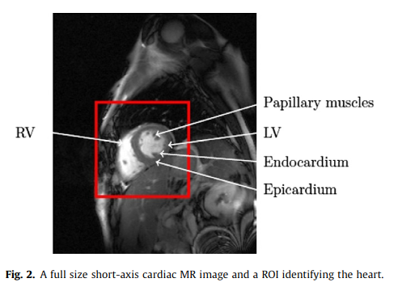
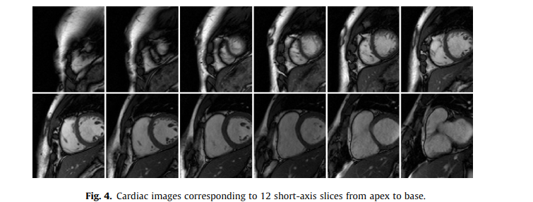

# Notes on traditional methods for segmentation

In the present paper, we will review automatic and semi-automatic segmentation methods of cine MR images of the cardiacventricles, using the short-axis view, the most common imagingplane to assess the cardiac function

## Major Challenges for this task

presented in Section2

### Description of short axis MR images

1. LV
   - Ellipsoid shape
   - surrounded by myocardium
   - thickness: 6 - 16mm
2. RV
   - crescent shape
   - faces lower pressure for ejecting blood
   - 3 - 6 mm thinner to LV, reaching the limit of MRI spatial resolution ( but proven to provide an accurate quantification of RV mass)
3. Image capturing
   - about 30 phases (images) can be capture during a cardiac cycle
   - a single examination can be made up of 250 images
4. Typical MR image

   - blood pools appear bright
   - myocardium and surroundings appear dark
   - spatial resolution $\approx$ 1.5mm/pexil
   - the above aspect is due to the bFFE sequence bFFE technique for better image quality then standard gradient echo
   - most of the fuzziness is caused by the blood flow and partial volume effects, aggravated by repiration motion artefacts 

### Issues in cardiac MR image segmentation

1. Epicardium
   - between the myocardium and surrounding tissues, thus it shows poor contrast
   - for RV, the difficulty incresses as the thickness goes down

2. Endocardium
   - gray level inhomogeneities in the blood flow
   - papillary muscles and trabeculations have the same intensity profile as the myocardium (According to clinical standards, they shouldnot be taken into account for endocardial wall segmentation)

3. Position along the apex-base axis
   - the slice level also effects the segmentation complexity
 

 ### Overvie of the segmentation methods

1. Segmentation for delineation the LV, the RV or both
   - Common categorization
        1. thresholding
        2. edge-based
        3. region-based
        4. pixel-based classification
        5. atlas-guided approaches
2. qualitative or quantitive assessment of the method
3. illustration on cardiac MR data

4. Three main levels of information used during the segmentation process
   1. no prior
   2. weak prior, includes anatomical and biomechanical models
   3. strong prior

5. Two main categories in this paper:
   1. week prior includes image-based and pixel classification based methods, as well as deformable models
   2. strong prior, includes shape prior based deformable models, active shape and appearance models and atlas based methods

## State-of-the-art methods

catagory: Section 3
details: Section 4
results: Section 5

### Ventricle segmentation in the cardiac MRI

#### Automatic Localization

1. Using time dimension, a difference or a variance image
   1. image difference: 
      1. computed bteween two images where the heart is the largest(basal or at end diastle)
      2. detect a circular region around LV using **Hough Transform**
      3. followed by **Texture analysis** and **K-means Clustering** to isolate the heart region
   2. Variance computation:
      1. variability along the time dimension
      2. projected resulting 3D image to 2D image
      3. applyying **Otsu**
      4. dilated several times
      5. the convex hull of the finally obtained region is the final 2D ROI
   3. Variance computation with FFT:
      1. FFT over time
      2. heart is the only moving object
2. Object detection techniques
   1. using trained classifier, key point is **feature extraction**
   2. In [Jolly et at.2001](), mark down some keywords:
      1. model the global profile using **Markov chian**.
      2. provides a cluster of pixels classified as positive, using **Hough Voting Procedure** on the individual profile to make the choice

#### Seg with weak or no prior

##### Image-based

endocardial and epicardial contours have different difficulties for seg. So, we can do that separately.

1. LV endocardium only
   1. using cost matrix and polar coordinate to search the path. Designing the **cost matrix** is the key
      1. thresholding
      2. fuzzy logic
      3. gray level
      4. wavelet-based enhancement
      5. radial lines

- **Dynamic Programming**

##### Pixel classification based

- GMM fitting( **Gaussian Mixture Model**)
- **Expectation-Minimization**
- number of guassians need to be fixed prior
- EM results canbe embedded in a cost matrix for DP
- Or, precedes a step based on Markov Random Fields
- Clustering
- compute the distance to a circle to indentify the LV cavity

- For supervised approaches

##### Deformable models

- iteratively deforming curves according to the minimization of an energy functional, comprising a data-driven term and a regularization term.

- offer great framework for 3D extension

- Volumetric modeling
  - LV myocardium is modeled as a linear elastic material defined by several paras, integrated into the stiffness matrix

##### Conclusion

#### Seg with strong prior

Statistical-model based segmentation, three main steps:
   1. Spatial alignmentof the 

##### Deformable based

variation of the deformable methods with weak or no prior. The principle is to modify the energy functional by introducing a new term that embeds an anatomical constraint on the contour, such as a distance to a reference shape model. 
1. compute the mean sined distance map
2. aligment transformation using criterion such as PDF, energy function of a graphcut

- others use of a PDE(?maybe it means PDF, not so sure)
  - based on a preliminary PCA on the training data. For a newcontour to be segmented, eigenvector weights as well as poseparameters are iteratively updated with a gradient descent, byminimizing the region-based energy term

##### Active shape and appearance model

The ASM consist of a statistical shape model, called Point Distri-bution Model (PDM), obtained by a PCA on the set of alignedshapes, and a method for searching the model in an image

- how it works:
  - placing the model on the image
  - iteratively estimating all needed parameters
  - constrint the weights within limits for specific shapes

ASM extended to grey level, thus yields AAM(active appearance models)

- Using hybrid multi-stage model of ASM & AAM is introduced for the following reasons:
  - AAM are optimized on global appearance butprovide imprecise border locations
  - ASM have a great ability to find local structures
- another usage: combine AAM with 3D shape model, correct the AAM result if it gets wrong
- another variant: replace PCA with ICA(Independent CA)

- limitation for all above: limited to mid-ventricular, end-diastolic images

- more reliable corresponding points during ASM by using robust estimator, such as Robust Point Matching

- another variant: 2D + time Active Appearance Motion Model (AAMM)

##### Atlas-guided segmentation and registration

##### Conclusion

**Key Technique: Hough Transform**
- Time-based: heart is the only moving object in the image
- vision based: circular aspect
- 

## future trends for traditional methods

perspectives: Section 6

## Appendix

### Translations for keywords

myocardium: 心肌层
Papillary muscles: 乳头状肌肉
Endocardium: 心内膜
Epicardium: 心外膜
LV: left ventricle 左心室 
aorta: 主动脉
cavity: 腔
crescent: 新月
respiration: 呼吸
delineating: 描绘
trabeculation: 小梁？
Apical: 顶端的
basal: 基础的
vincinity: 附近
atria: 心房
diastole: 舒张期
systole: 收缩 
aperture: 光圈
intramyocardial: 心肌内 
dilated: 扩张的
hull: 船体