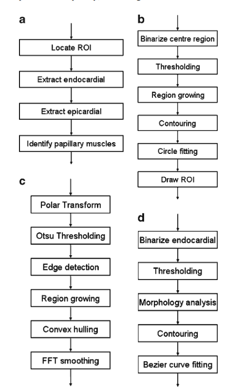

# Draft for schedule

## Get familiar with the dataset

about 1 week on this

- file I/O

- do a sort according to the plane, and then to trigger time. (how to access the time axis?)

- Select the diastole and the systole. 

- Manage the distance between slices.

- Then try to apply the algorithm step by step on one image

about 1 month on this ( finished in mid Apr. )

    1. LV center and ROI Localization
    2. LV Segmentation
       1. find the ES and ED (automatically or be done before)
       2. Endocardial Contouring
       3. Epicardial Contouring
       4. Papillary Muscle Segmentation

- Evaluation
  - define measurement and show the error information

- User interface | one week

- Debug & Test | one week 

- Academic paper | one week

- Presentation | one week

everything will be finished in mid May